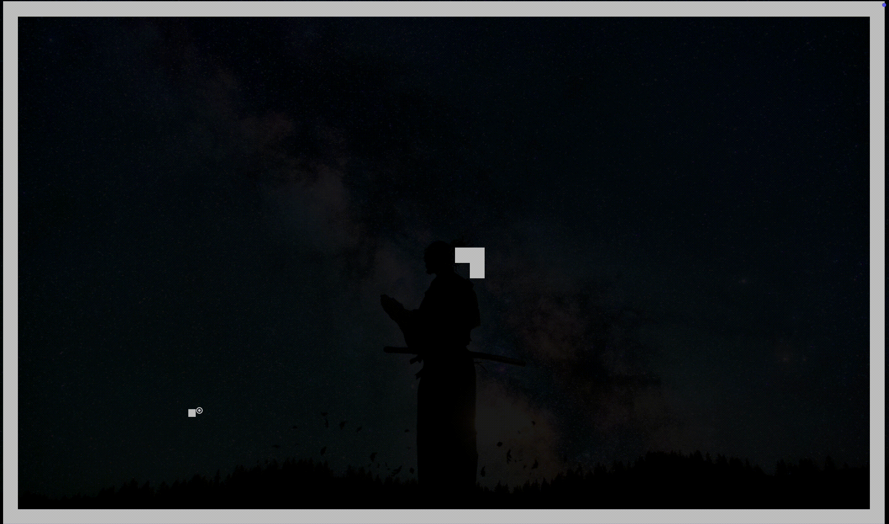

# Snake Game in Rust

A classic snake game implemented in Rust using the `crossterm` library for terminal manipulation.

## Gameplay

You control a snake that moves around the screen, eating food to grow longer. The game ends if the snake collides with the walls or with its own body.


## How to Run

1.  **Clone the repository:**

    ```bash
    git clone https://github.com/hitendra4l/snake
    cd snake
    ```

2.  **Run the game:**
    ```bash
    cargo run
    ```

## Controls

- **Move Up:** `w`, `k`, or `Up Arrow`
- **Move Down:** `s`, `j`, or `Down Arrow`
- **Move Left:** `a`, `h`, or `Left Arrow`
- **Move Right:** `d`, `l`, or `Right Arrow`
- **Quit:** `q`

## Technical Details

This project uses the `crossterm` crate to handle terminal events, cursor positioning, and styling. The game logic is separated into a `lib.rs` file to keep the code modular.

- **Rendering:** The game renders in the terminal, using block characters to create the snake and the borders. The movement is adjusted to account for the typical 2:1 height-to-width ratio of terminal characters, so the snake appears to move in a grid of squares.
- **State Management:** The game state, including the snake's position, direction, and the food's location, is managed in a `GameState` struct.
- **Terminal Handling:** The terminal is put into raw mode to allow for direct key press reads without needing to press Enter. A `TerminalGuard` struct ensures that the terminal state is gracefully restored when the program exits, even in case of a panic.
